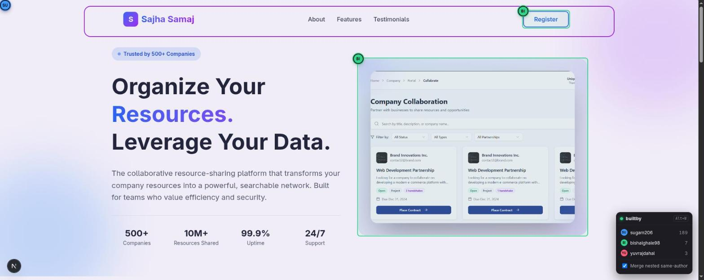
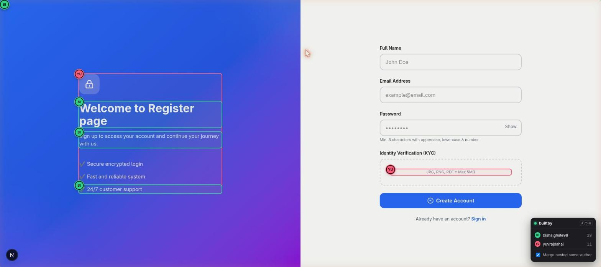
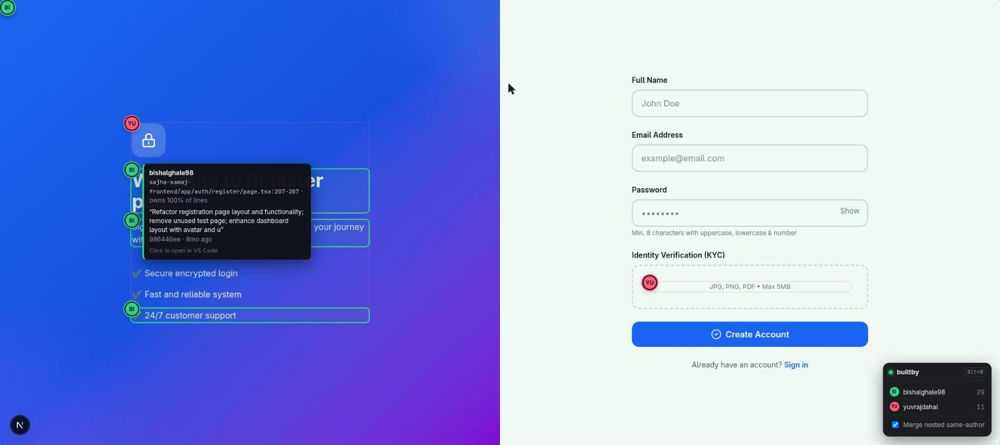

# builtby

See who built which part of your UI. `git blame`, drawn on the running page.

When several developers work on one frontend, it's hard to tell who made which section, button, or card.
builtby draws a colored ring and an avatar badge around each part of the page, one color per developer,
straight from your git history.



- **One color per developer.** Every element gets a ring and an initials badge for the person who owns most of its JSX lines.
- **Commit details on hover.** Author, email, file and line range, ownership %, commit message, and when.
- **Click to open in VS Code.** Jumps straight to the file and line.
- **No backend.** Blame runs inside your dev server. Nothing to deploy, no API keys.
- **Dev only.** Production builds are untouched.

## Example

Here is builtby on [Sajha Samaj](https://github.com/aces-erc/taranga-1.0-software-hackathon__BCA-ASSOCIATION-MMAMC),
a hackathon project built by a team of developers.

**Sections by different people.** On the register page, the outer card is one developer's work (red),
while the heading, subtitle, and checklist inside it were written by another (green):



**Hover a badge for the details.** Author, file and line range, how much of it they wrote, and the commit.
Everyone else's rings fade out:



## Requirements

- Next.js 13+ using the **webpack** dev server. Turbopack is not supported yet.
  - Next.js 13–15: `next dev` uses webpack by default.
  - Next.js 16+: Turbopack is the default, so run `next dev --webpack`.
- The project must be a **git repository** with `git` available on your PATH.
- React (`.jsx` / `.tsx` files).

## Install

```bash
npm install --save-dev builtby
```

## Setup

Wrap your Next.js config with `withBuiltBy`.

**`next.config.mjs`**

```js
import withBuiltBy from "builtby/next";

/** @type {import('next').NextConfig} */
const nextConfig = {
  // your existing config
};

export default withBuiltBy(nextConfig);
```

**`next.config.js` (CommonJS)**

```js
const withBuiltBy = require("builtby/next");

module.exports = withBuiltBy({
  // your existing config
});
```

**`next.config.ts`**

```ts
import type { NextConfig } from "next";
import withBuiltBy from "builtby/next";

const nextConfig: NextConfig = {
  // your existing config
};

export default withBuiltBy(nextConfig);
```

If you already have a custom `webpack()` function in your config, keep it. builtby calls it first, then adds its own loader.

## Usage

1. Start the dev server as usual:

   ```bash
   npm run dev
   ```

   On Next.js 16+, use webpack:

   ```bash
   npx next dev --webpack
   ```

   Or change your `dev` script in `package.json` to `"next dev --webpack"`.

2. Open your app in the browser. A small **builtby** panel appears in the bottom-right corner.
3. Turn the overlay on by clicking the panel header, or press **Alt+W**.

| You see | What it means |
|---|---|
| Colored ring around a section | That section's markup was mostly written by one developer. |
| Circle badge with initials | Who that developer is. Same color = same person. |
| Panel list | Every developer on the current page, with how many elements they own. |

**Things you can do:**

- **Hover a badge** to see the author, email, `file:start-end`, ownership share, commit message, and how long ago.
  The other developers' rings fade so you can focus on one person.
- **Click a badge** to open that file at that line in VS Code.
- **Click a name in the panel** to hide or show that developer's rings.
- **Merge nested same-author** (checkbox in the panel). On by default: if a whole section belongs to one person, you get one ring
  instead of a ring on every child. Turn it off to see every element.
- Your on/off state and filters are remembered per browser.

**Uncommitted work** shows up as **"Uncommitted"**, so you can see your own in-progress changes before you commit.

## Turning it off

- Press **Alt+W** or click the panel header to hide the overlay.
- Set `BUILTBY=0` to disable builtby entirely for a run:

  ```bash
  BUILTBY=0 npm run dev
  ```

- `next build` / production: builtby does nothing. No attributes, no overlay, no extra bytes.

## Tips for teams

- **One person shows up twice?** They committed under two names (for example `yuvrajdahal` and `Yuvraj Dahal`).
  Add a `.mailmap` file at the repo root to merge them:

  ```
  Yuvraj Dahal <me@example.com> yuvrajdahal <me@example.com>
  ```

- **Formatting commits steal ownership?** List those commit hashes in `.git-blame-ignore-revs` at the repo root.
  builtby picks it up automatically.
- Ownership is decided by **who wrote the most lines** of each element, so a one-line tweak doesn't take over a whole section.
  Moved and copied lines keep their original author (`git blame -M`), and whitespace-only changes are ignored (`-w`).

## How it works

1. A webpack `pre` loader parses each `.jsx` / `.tsx` file and runs `git blame` on it.
2. For every DOM element in the JSX (`div`, `button`, `motion.div`, ...), it works out who owns the most lines
   and adds a `data-builtby` attribute with the author, commit, and line range.
3. Because the data lives in the rendered HTML, React Server Components work too.
4. A small overlay script (plain JS inside a Shadow DOM, so your CSS can't break it) reads those attributes and draws the rings.

## Troubleshooting

| Problem | Fix |
|---|---|
| No panel appears | Make sure the dev server runs on webpack: `next dev` on Next.js 13–15, `next dev --webpack` on Next.js 16+ (not Turbopack), and that the config is wrapped with `withBuiltBy`. Restart the dev server after changing the config. |
| Panel says "No tagged elements" | The project isn't a git repo, or the page only renders components from `node_modules`. |
| Everything says "Uncommitted" | The files aren't committed yet. Commit them and refresh. |
| Alt+W does nothing | Your desktop or browser may be using that shortcut. Click the panel header instead. |
| Click doesn't open the editor | VS Code must be installed and registered for `vscode://` links. |

## Roadmap

- Vite plugin (React, Vue, Svelte)
- Turbopack support
- "Changed since `main`" filter for reviewing PRs
- Links to the commit or PR on GitHub / GitLab
- Chrome extension for staging URLs

## Contributing

Issues and pull requests are welcome. To work on builtby locally:

```bash
git clone https://github.com/yuvrajdahal/builtby.git
cd builtby
npm install
```

Then point a Next.js app at your local copy:

```js
// next.config.mjs in any Next.js app
import withBuiltBy from "../builtby/src/next.js";
export default withBuiltBy({});
```

## License

[MIT](LICENSE) © Yuvraj Dahal
